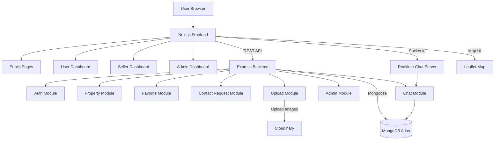
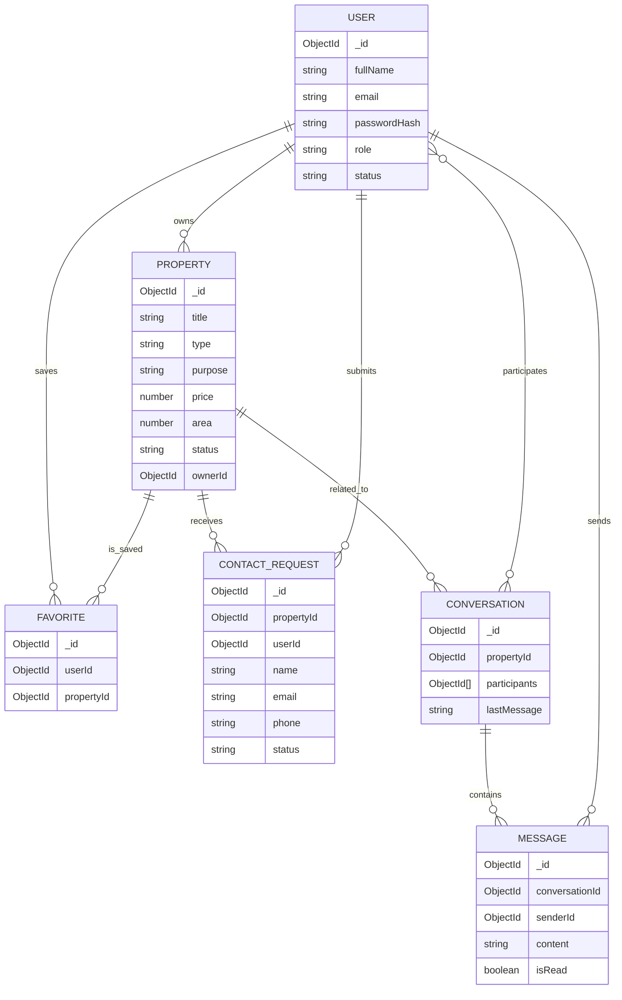
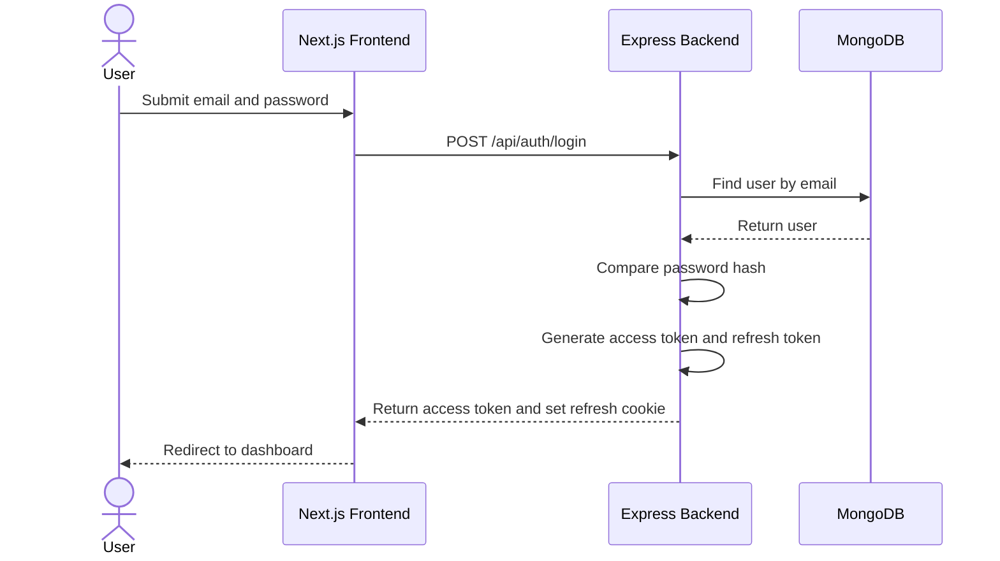
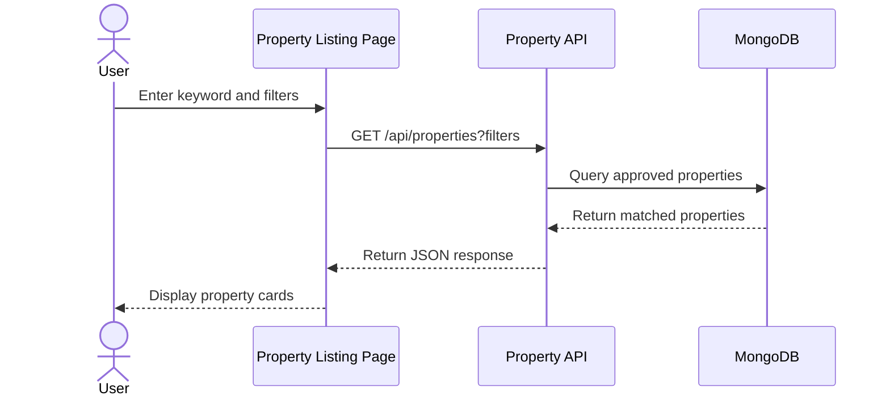
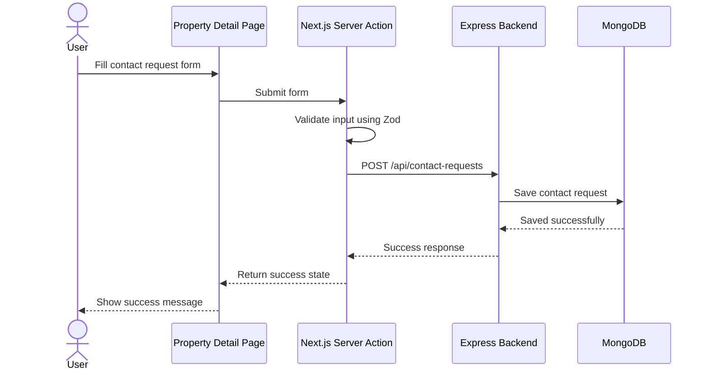
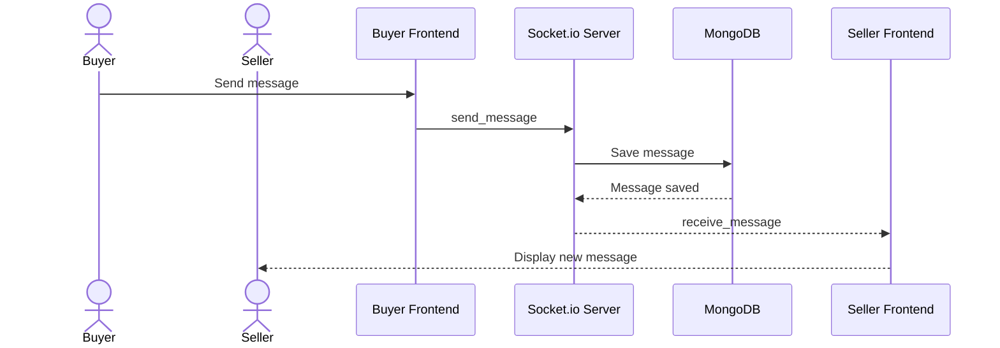
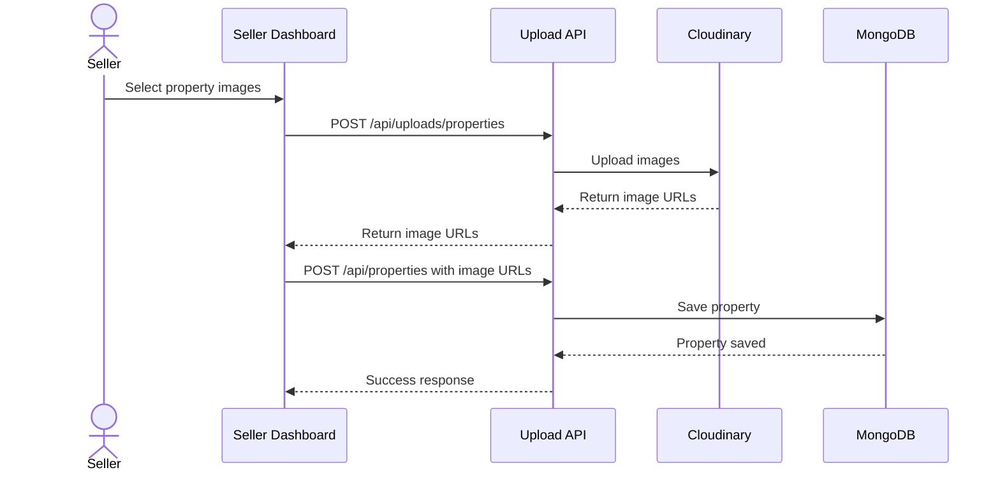

# High-Level Design Document  
## Project: RealEstateHub – Mini Real Estate Marketplace

---

## 1. Introduction

### 1.1 Purpose

This High-Level Design document describes the overall architecture and major design decisions of **RealEstateHub**, a mini real estate marketplace web application. The document translates the Software Requirements Specification into a technical architecture that can guide detailed design, implementation, testing, and deployment.

The HLD focuses on:

- System architecture
- Main modules and components
- Data model overview
- API design overview
- Authentication and authorization design
- Realtime chat design
- Upload and map integration design
- Deployment architecture
- Security, performance, and maintainability considerations

---

### 1.2 Project Scope

RealEstateHub allows users to search, view, compare, and save real estate properties. Sellers can create and manage property listings. Admins can manage users, approve or reject property posts, and monitor system statistics.

The main features include:

- User registration and login
- Role-based access control
- Property listing management
- Search and advanced filtering
- Property detail page
- Property comparison
- Favorite properties
- Contact request using Next.js Server Action
- Realtime consultation chat
- Property image upload
- Map integration
- Admin dashboard
- Deployment to cloud platforms

---

## 2. Technology Stack

| Layer | Technology |
|---|---|
| Frontend | Next.js 14+ App Router |
| Styling | Tailwind CSS |
| UI Components | shadcn/ui, Radix UI |
| Form Validation | React Hook Form + Zod |
| State Management | Zustand or Context API |
| Backend | Node.js + Express.js |
| Architecture Pattern | Router - Controller - Service - Model |
| Database | MongoDB Atlas |
| ODM | Mongoose |
| Authentication | JWT Access Token + Refresh Token |
| Realtime | Socket.io |
| File Upload | Cloudinary |
| Map | Leaflet / React Leaflet |
| Deployment FE | Vercel |
| Deployment BE | Render or Railway |
| Version Control | GitHub |

---

## 3. User Roles and Actors

The system supports **three authenticated roles** and **one public actor**.

| Actor / Role | Main Responsibility |
|---|---|
| Guest | Browse properties, search/filter, view property detail, register, login |
| User / Buyer / Renter | Save favorites, compare properties, submit contact request, chat with seller |
| Seller / Agent | Create, edit, delete, and manage own property listings |
| Admin | Approve, reject, hide listings, view statistics, manage users |

---

## 4. High-Level System Architecture

### 4.1 Architecture Overview

```text
User Browser
    |
    | HTTPS
    v
Next.js Frontend
    |
    | REST API / JSON
    v
Express.js Backend
    |
    | Mongoose ODM
    v
MongoDB Atlas

External Services:
- Cloudinary: property image storage
- Socket.io: realtime chat communication
- Leaflet / OpenStreetMap: property map display
```

---

### 4.2 Component Diagram



---

## 5. Frontend Design

### 5.1 Frontend Responsibilities

The frontend is responsible for:

- Rendering public and protected pages
- Handling user interaction
- Calling backend REST APIs
- Managing authentication state
- Managing compare list and favorite state
- Displaying validation errors
- Connecting to Socket.io for realtime chat
- Displaying property locations on map
- Submitting contact request through Server Action

---

### 5.2 Frontend Route Design

| Route | Description | Access | Rendering Strategy |
|---|---|---|---|
| `/` | Homepage | Public | SSG |
| `/properties` | Property listing with search/filter | Public | SSR |
| `/properties/[id]` | Property detail page | Public | SSR / ISR |
| `/compare` | Compare selected properties | Public/User | CSR |
| `/login` | Login page | Guest | CSR |
| `/register` | Register page | Guest | CSR |
| `/profile` | User profile | User | CSR |
| `/favorites` | Favorite properties | User | CSR |
| `/chat` | Conversation list | User/Seller | CSR |
| `/dashboard` | Seller dashboard | Seller | CSR |
| `/dashboard/properties` | Seller property list | Seller | CSR |
| `/dashboard/properties/new` | Create property post | Seller | CSR |
| `/dashboard/properties/[id]/edit` | Edit property post | Seller | CSR |
| `/admin` | Admin dashboard | Admin | CSR |
| `/admin/users` | User management | Admin | CSR |
| `/admin/properties` | Property management | Admin | CSR |

---

### 5.3 Frontend Folder Structure

```text
frontend/
  app/
    layout.tsx
    page.tsx
    properties/
      page.tsx
      [id]/
        page.tsx
    compare/
      page.tsx
    login/
      page.tsx
    register/
      page.tsx
    profile/
      page.tsx
    favorites/
      page.tsx
    chat/
      page.tsx
    dashboard/
      layout.tsx
      page.tsx
      properties/
        page.tsx
        new/
          page.tsx
        [id]/
          edit/
            page.tsx
    admin/
      layout.tsx
      page.tsx
      users/
        page.tsx
      properties/
        page.tsx
  components/
    common/
    property/
    auth/
    chat/
    admin/
  lib/
    api.ts
    auth.ts
    socket.ts
    validations.ts
  store/
    authStore.ts
    compareStore.ts
  types/
```

---

## 6. Backend Design

### 6.1 Backend Responsibilities

The backend is responsible for:

- Authentication and authorization
- User management
- Property CRUD operations
- Property search and filtering
- Favorite management
- Contact request management
- Image upload handling
- Admin approval workflow
- Chat data persistence
- Error handling and response formatting

---

### 6.2 Backend Architecture Pattern

The backend follows a layered architecture:

```text
Route → Controller → Service → Model → Database
```

| Layer | Responsibility |
|---|---|
| Route | Defines API endpoints and middleware |
| Controller | Handles HTTP request and response |
| Service | Contains business logic |
| Model | Defines Mongoose schema and database access |
| Middleware | Handles authentication, authorization, validation, and errors |

---

### 6.3 Backend Folder Structure

```text
backend/
  src/
    config/
      db.js
      cloudinary.js
      socket.js
    models/
      User.js
      Property.js
      Favorite.js
      Conversation.js
      Message.js
      ContactRequest.js
    routes/
      auth.routes.js
      property.routes.js
      favorite.routes.js
      upload.routes.js
      chat.routes.js
      contactRequest.routes.js
      admin.routes.js
    controllers/
      auth.controller.js
      property.controller.js
      favorite.controller.js
      upload.controller.js
      chat.controller.js
      contactRequest.controller.js
      admin.controller.js
    services/
      auth.service.js
      property.service.js
      favorite.service.js
      upload.service.js
      chat.service.js
      contactRequest.service.js
      admin.service.js
    middlewares/
      auth.middleware.js
      role.middleware.js
      validate.middleware.js
      error.middleware.js
    seed/
      seedUsers.js
      seedProperties.js
    utils/
      generateToken.js
      apiResponse.js
      logger.js
    server.js
```

---

## 7. Main Module Design

### 7.1 Authentication Module

The Authentication Module manages registration, login, logout, token refresh, and current user retrieval.

Main functions:

- Register new user
- Login user
- Generate access token and refresh token
- Refresh access token
- Logout user
- Protect private routes
- Enforce role-based access

Token storage decision:

- Refresh token is stored in an HttpOnly cookie.
- Access token is returned to the frontend and stored in memory or global auth state.
- When the access token expires, the frontend calls `/api/auth/refresh`.
- Sensitive values such as JWT secret and database URI are stored in environment variables.

---

### 7.2 Property Module

The Property Module manages real estate listings.

Main functions:

- Create property listing
- Update property listing
- Delete property listing
- View property detail
- Search and filter properties
- Manage property status

New property posts are created with `pending` status by default. Only approved properties are visible to public users.

---

### 7.3 Favorite Module

The Favorite Module allows authenticated users to save and remove favorite properties.

Main functions:

- Add property to favorites
- Remove property from favorites
- View favorite property list
- Prevent duplicate favorite records

---

### 7.4 Compare Module

The Compare Module is mainly handled on the frontend using global state.

Main functions:

- Add property to compare list
- Remove property from compare list
- Compare maximum 3 properties
- Display comparison table

The compare state may be stored in Zustand or local storage for better user experience.

---

### 7.5 Contact Request Module

The Contact Request Module allows users or guests to submit a request for consultation from a property detail page.

This feature is implemented using **Next.js Server Action**.

Flow:

1. User opens `/properties/[id]`.
2. User fills the contact request form.
3. The form is submitted through a Next.js Server Action.
4. Server Action validates input using Zod.
5. Server Action sends the request to Express backend.
6. Backend stores the request in MongoDB.
7. Frontend displays success or validation error message.

Main fields:

- propertyId
- name
- email
- phone
- message
- status

---

### 7.6 Realtime Chat Module

The Realtime Chat Module allows users and sellers to communicate in realtime.

Main functions:

- Create conversation
- Join conversation room
- Send message
- Receive message
- Store message history
- Load previous messages
- Show typing indicator if possible

Socket events:

```text
join_conversation
send_message
receive_message
typing
message_read
```

---

### 7.7 Upload Module

The Upload Module handles property image upload through Cloudinary.

Main functions:

- Upload property images
- Validate file type and file size
- Store image URLs in property records
- Support image preview on frontend

Validation rules:

- Allowed formats: JPG, JPEG, PNG, WEBP
- Maximum file size: 5MB per image
- Maximum number of images: 10 per property

---

### 7.8 Map Module

The Map Module displays property locations using Leaflet.

Main functions:

- Show property marker on detail page
- Show multiple property markers on listing page
- Display marker popup with title, price, and detail link
- Use latitude and longitude stored in property data

---

### 7.9 Admin Module

The Admin Module allows administrators to manage platform data.

Main functions:

- View dashboard statistics
- View users
- Update user role or status
- View pending property posts
- Approve property posts
- Reject property posts
- Hide inappropriate property posts

---

## 8. API Design Overview

### 8.1 Authentication APIs

| Method | Endpoint | Description | Role |
|---|---|---|---|
| POST | `/api/auth/register` | Register new account | Guest |
| POST | `/api/auth/login` | Login | Guest |
| POST | `/api/auth/refresh` | Refresh access token | User |
| POST | `/api/auth/logout` | Logout | User |
| GET | `/api/auth/me` | Get current user | User |

---

### 8.2 Property APIs

| Method | Endpoint | Description | Role |
|---|---|---|---|
| GET | `/api/properties` | Get approved properties with filters | Public |
| GET | `/api/properties/:id` | Get property detail | Public |
| POST | `/api/properties` | Create property listing | Seller/Admin |
| PUT | `/api/properties/:id` | Update property listing | Owner/Admin |
| DELETE | `/api/properties/:id` | Delete property listing | Owner/Admin |
| PATCH | `/api/properties/:id/status` | Update property status | Admin |

Example query:

```text
GET /api/properties?city=HoChiMinh&type=apartment&purpose=rent&minPrice=5000000&maxPrice=15000000
```

---

### 8.3 Upload APIs

| Method | Endpoint | Description | Role |
|---|---|---|---|
| POST | `/api/uploads/properties` | Upload property images to Cloudinary | Seller/Admin |

---

### 8.4 Favorite APIs

| Method | Endpoint | Description | Role |
|---|---|---|---|
| GET | `/api/favorites/me` | Get my favorite properties | User |
| POST | `/api/favorites/:propertyId` | Add property to favorites | User |
| DELETE | `/api/favorites/:propertyId` | Remove property from favorites | User |

---

### 8.5 Contact Request APIs

| Method | Endpoint | Description | Role |
|---|---|---|---|
| POST | `/api/contact-requests` | Create contact request | Guest/User |
| GET | `/api/contact-requests/me` | Get my contact requests | User |
| GET | `/api/admin/contact-requests` | Manage all contact requests | Admin |

---

### 8.6 Chat APIs

| Method | Endpoint | Description | Role |
|---|---|---|---|
| GET | `/api/conversations` | Get my conversations | User/Seller |
| POST | `/api/conversations` | Create conversation | User |
| GET | `/api/conversations/:id/messages` | Get messages | User/Seller |
| POST | `/api/conversations/:id/messages` | Send message fallback API | User/Seller |

---

### 8.7 Admin APIs

| Method | Endpoint | Description | Role |
|---|---|---|---|
| GET | `/api/admin/stats` | Get dashboard statistics | Admin |
| GET | `/api/admin/users` | Get user list | Admin |
| PATCH | `/api/admin/users/:id/role` | Update user role | Admin |
| PATCH | `/api/admin/users/:id/status` | Update user status | Admin |
| GET | `/api/admin/properties/pending` | Get pending properties | Admin |
| PATCH | `/api/admin/properties/:id/approve` | Approve property | Admin |
| PATCH | `/api/admin/properties/:id/reject` | Reject property | Admin |
| PATCH | `/api/admin/properties/:id/hide` | Hide property | Admin |

---

### 8.8 System APIs

| Method | Endpoint | Description | Role |
|---|---|---|---|
| GET | `/api/health` | Check backend health status | Public |

---

## 9. Data Design Overview

### 9.1 User Collection

| Field | Type | Note |
|---|---|---|
| _id | ObjectId | Primary key |
| fullName | String | Required |
| email | String | Required, unique |
| passwordHash | String | Required |
| phone | String | Optional |
| role | Enum | admin / seller / user |
| avatar | String | Optional |
| refreshToken | String | Optional |
| status | Enum | active / blocked |
| createdAt | Date | Auto |
| updatedAt | Date | Auto |

---

### 9.2 Property Collection

| Field | Type | Note |
|---|---|---|
| _id | ObjectId | Primary key |
| title | String | Required |
| description | String | Required |
| type | Enum | apartment / house / land / villa / office |
| purpose | Enum | sale / rent |
| price | Number | Required |
| area | Number | Required |
| bedrooms | Number | Optional |
| bathrooms | Number | Optional |
| address | String | Required |
| city | String | Required |
| district | String | Optional |
| ward | String | Optional |
| latitude | Number | Required for map |
| longitude | Number | Required for map |
| images | String[] | Cloudinary URLs |
| amenities | String[] | Optional |
| ownerId | ObjectId | Ref User |
| status | Enum | pending / approved / rejected / hidden |
| createdAt | Date | Auto |
| updatedAt | Date | Auto |

---

### 9.3 Favorite Collection

| Field | Type | Note |
|---|---|---|
| _id | ObjectId | Primary key |
| userId | ObjectId | Ref User |
| propertyId | ObjectId | Ref Property |
| createdAt | Date | Auto |

---

### 9.4 Conversation Collection

| Field | Type | Note |
|---|---|---|
| _id | ObjectId | Primary key |
| propertyId | ObjectId | Ref Property |
| participants | ObjectId[] | Ref User |
| lastMessage | String | Latest message preview |
| createdAt | Date | Auto |
| updatedAt | Date | Auto |

---

### 9.5 Message Collection

| Field | Type | Note |
|---|---|---|
| _id | ObjectId | Primary key |
| conversationId | ObjectId | Ref Conversation |
| senderId | ObjectId | Ref User |
| content | String | Message content |
| isRead | Boolean | Default false |
| createdAt | Date | Auto |

---

### 9.6 ContactRequest Collection

| Field | Type | Note |
|---|---|---|
| _id | ObjectId | Primary key |
| propertyId | ObjectId | Ref Property |
| userId | ObjectId | Optional, Ref User |
| name | String | Required |
| email | String | Required |
| phone | String | Required |
| message | String | Required |
| status | Enum | new / contacted / closed |
| createdAt | Date | Auto |

---

## 10. ERD Overview



Note: `Conversation` uses `participants: ObjectId[]`, so the relationship between `User` and `Conversation` is many-to-many.

---

## 11. Database Index Design

| Collection | Index | Purpose |
|---|---|---|
| User | email unique | Prevent duplicate accounts |
| Property | status, city, purpose, type | Optimize search and filtering |
| Property | price | Optimize price range filter |
| Property | area | Optimize area range filter |
| Property | text index on title, description, address | Support keyword search |
| Favorite | userId + propertyId unique | Prevent duplicate favorites |
| Conversation | participants, propertyId | Find user conversations by property |
| Message | conversationId + createdAt | Load chat history efficiently |
| ContactRequest | propertyId, createdAt | Manage contact requests by property |

---

## 12. Business Rules Design

| Rule ID | Description |
|---|---|
| BR-01 | New property listings are created with `pending` status by default. |
| BR-02 | Only approved properties are visible to guests and normal users. |
| BR-03 | Sellers can update or delete only their own properties. |
| BR-04 | Admin can approve, reject, hide, or delete any property. |
| BR-05 | A user can favorite the same property only once. |
| BR-06 | A user can compare a maximum of 3 properties. |
| BR-07 | Chat conversations are linked to one property and include buyer and seller. |
| BR-08 | Property images must be uploaded before or during property creation. |
| BR-09 | Blocked users cannot create properties, favorite properties, or send messages. |
| BR-10 | Contact requests can be submitted by both guests and authenticated users. |

---

## 13. Important Sequence Diagrams

### 13.1 Login Flow



---

### 13.2 Property Search Flow



---

### 13.3 Contact Request Server Action Flow



---

### 13.4 Realtime Chat Flow



---

### 13.5 Property Image Upload Flow



---

## 14. Security Design

| Area | Design Decision |
|---|---|
| Password | Hash passwords using bcrypt |
| Authentication | Use JWT access token and refresh token |
| Refresh Token | Store in HttpOnly cookie |
| Authorization | Use role-based middleware |
| Input Validation | Validate request body using Zod or backend validator |
| Environment Variables | Store secrets in `.env`, provide `.env.example` |
| File Upload | Validate file type and file size |
| Error Handling | Do not expose stack trace in production |
| Logging | Do not log passwords, tokens, or secrets |

---

## 15. Error Handling Design

The backend returns consistent JSON responses.

Success response:

```json
{
  "success": true,
  "message": "Request successful",
  "data": {}
}
```

Error response:

```json
{
  "success": false,
  "message": "Validation error",
  "errors": []
}
```

Common HTTP status codes:

| Status Code | Meaning |
|---|---|
| 200 | OK |
| 201 | Created |
| 400 | Bad Request |
| 401 | Unauthorized |
| 403 | Forbidden |
| 404 | Not Found |
| 409 | Conflict |
| 500 | Internal Server Error |

---

## 16. Logging and Health Check

### 16.1 Health Check

The backend provides a health check endpoint:

```text
GET /api/health
```

Example response:

```json
{
  "success": true,
  "message": "RealEstateHub API is running",
  "timestamp": "2026-06-09T00:00:00.000Z"
}
```

### 16.2 Logging

The backend logs:

- Request method
- Request URL
- Response status code
- Error messages
- Runtime errors

The backend does not log:

- Passwords
- Access tokens
- Refresh tokens
- API keys
- Database connection strings

---

## 17. Seed Data Design

The backend provides seed scripts for demo data.

Seed data includes:

- One admin account
- Several seller accounts
- Several normal user accounts
- Sample properties in different cities
- Sample property images
- Sample map coordinates
- Sample pending and approved property posts

Suggested folder:

```text
backend/
  src/
    seed/
      seedUsers.js
      seedProperties.js
```

Seed data supports:

- Search and filter demo
- Property detail demo
- Map marker demo
- Comparison demo
- Admin approval workflow demo

---

## 18. Deployment Design

### 18.1 Deployment Architecture

```text
User Browser
    |
    v
Vercel - Next.js Frontend
    |
    | HTTPS REST API
    v
Render/Railway - Express Backend
    |
    v
MongoDB Atlas

External:
- Cloudinary for images
- Leaflet/OpenStreetMap for map
```

---

### 18.2 Environment Variables

Frontend `.env.example`:

```text
NEXT_PUBLIC_API_URL=
NEXT_PUBLIC_SOCKET_URL=
```

Backend `.env.example`:

```text
PORT=
MONGODB_URI=
JWT_ACCESS_SECRET=
JWT_REFRESH_SECRET=
JWT_ACCESS_EXPIRES_IN=
JWT_REFRESH_EXPIRES_IN=
CLOUDINARY_CLOUD_NAME=
CLOUDINARY_API_KEY=
CLOUDINARY_API_SECRET=
CLIENT_URL=
```

---

## 19. Requirement Traceability Summary

| Requirement | HLD Component |
|---|---|
| Authentication and Authorization | Auth Module, JWT Design, Role Middleware |
| Property CRUD | Property Module, Property APIs |
| Search and Filter | Property APIs, Database Index Design |
| Property Detail | Frontend Routes, Property Module |
| Compare Properties | Compare Module, Zustand Store |
| Favorite Properties | Favorite Module, Favorite APIs |
| Realtime Chat | Chat Module, Socket.io Design |
| Image Upload | Upload Module, Cloudinary Design |
| Map Integration | Map Module, Leaflet Design |
| Admin Dashboard | Admin Module, Admin APIs |
| Contact Request Server Action | Contact Request Module, Server Action Flow |
| Database Collections | Data Design Overview, ERD |
| Rendering Strategy | Frontend Route Design |
| State Management | Frontend Design |
| Deployment | Deployment Design |
| Security | Security Design |
| Error Handling | Error Handling Design |

---

## 20. Conclusion

This High-Level Design defines the architecture of RealEstateHub as a fullstack real estate marketplace using Next.js, Express.js, MongoDB, Socket.io, Cloudinary, and Leaflet. The design separates frontend, backend, database, realtime communication, and external services clearly.

The architecture supports the main business features: property listing, search/filter, property detail, comparison, favorites, realtime chat, image upload, map integration, admin approval workflow, and contact request through Server Action.

This HLD is ready to be used as the foundation for Low-Level Design, implementation, testing, deployment, and final project reporting.
